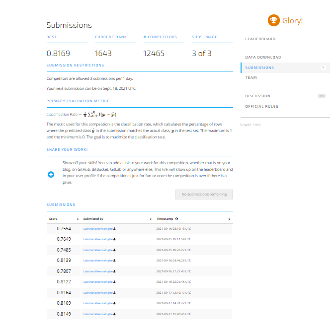

## Preprocessing techniques

1. Imputed following categorical features with most frequent value 
    `quantity`,`management_group`,`source_class`, `basin`,  `payment`, `payment_type`, `permit`, 
    `quantity_group`, `water_quality`, `quality_group`, `region`, `extraction_type_group`, `extraction_type`, 
    `source`, `source_type`, `waterpoint_type`, `waterpoint_type_group`, `scheme_management`, `subvillage`,
     `ward`, `wpt_name`

2. Imputed following categorical features with constant
    `lga`, `installer`, `funder`,`extraction_type_class`, `management`.

3. Imputed all numerical features with `mean`.

4. Scale all numerical features using `StandardScaler`

## Feature Engineering techniques

1. Created new features `year_recorder`, `yearly_week_recorder`, `month_recorder` using `date_recorded` and `construction_year`.

2. Created a new feature `age` by subtracting `date_recorded` and `construction_year`.

3. Created two new features `distance` and `angle` using `latitude` and `longitude`.

4. Created two new features `distance_pca0` and `distance_pca1` by applying Principal Component Analysis to `latitude` and `longitude`.

5. Applied OneHot Encoding for following features 
    `quantity`,`management_group`,`source_class`

6. Applied Target Encoding for following features 
     `lga`, `installer`, `funder`,`extraction_type_class`, `management`

7. Applied Label Encoding for following features 
    `basin`,  `payment`, `payment_type`, `permit`, `quantity_group`, `water_quality`, `quality_group`, `region`, 
    `extraction_type_group`, `extraction_type`, `source`, `source_type`, `waterpoint_type`, `waterpoint_type_group`, 
    `scheme_management`, `subvillage`, `ward`, `wpt_name`

8. Mutual Information scores used to select most appropriate features to train the model as feature selection technique.

## Model Selection 

1. Initially used `XGBClassifier`, `RandomForestClassifier` and `CatBoostClassifier`.
    Finally selected `RandomForestClassifier` as the model to do experiments as it give best results in the selection process.

## Proof of submission

## Final Rank
### 1643

## Final Score 
### 0.8169
